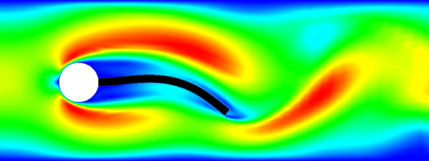

# Introduction

## What is a Benchmark

I haven't found a clear definition of what a benchmark is.
<!-- (maybe in contrast to a *numerical example*). -->
However, here is what I think makes a *numerical example* a
benchmark

1. **Common acceptance as a benchmark** -- there are other publications that
   discuss the same setup.
2. **Practical relevance** -- either in applications or as a testing field for
   numerical algorithms.
3. **Reliable reference data** -- so that others can test their codes and
   methods against it.
   
## What is a Benchmark

> Basically, everything that would motivate a fellow researchers to use the
provided setup and data to *benchmark* their code.

## Fluid Structure Interaction

 * Changing domain.
 * Coupling of Models (and scales).

# The model

## Verbose

 * A fluid flows through a channel with a sphere that can rotate freely.
 * The stresses at the sphere/fluid interface induce rotation.
 * The *no-slip* condition induces motion of the flow at the interface.

---

### The flow

\begin{equation*}
		\rho_f\left(\partial_t v + (v \cdot\nabla)v \right) - \nabla \cdot \sigma(v ,p) = 0, \quad \nabla\cdot v  = 0,
\end{equation*}
with the stress-tensor
\begin{equation*}
	\sigma (v,p) = \rho _ f\nu\left( \nabla v+\nabla v^T \right) - p I
\end{equation*} 
and with standard boundary conditions and in particular
\begin{equation*}
    v = v_s, \quad \text{on } \mathcal I,
\end{equation*}
where $v_s$ is the solid's velocity at the fluid-solid interface.

# Implementation

## Code Base {data-background-image="pics/grid.png"}

There were 5 independent implementations using established libraries:

 * [Netgen/NGSolve](https://ngsolve.org/)
 * [FEniCS/dolfin](https://fenicsproject.org/download/)
 * Gascoigne
 * [SciPy](https://www.scipy.org)

## Code Availability {data-background-image="pics/zenodo-screenshot.png"}

. . .

::: {style="position: absolute; width: 60%; right: 0; box-shadow: 0 1px 4px rgba(0,0,0,0.5), 0 5px 25px rgba(0,0,0,0.2); background-color: rgba(0, 0, 0, 0.9); color: #fff; padding: 20px; font-size: 40px; text-align: left;"}
Full data sets for the results as well as all implementations can be found at

> [DOI: 10.5281/zenodo.3253455](https://doi.org/10.5281/zenodo.3253455)

:::

# Conclusion

## References

---
nocite: |
    @WahRLHM19
...
